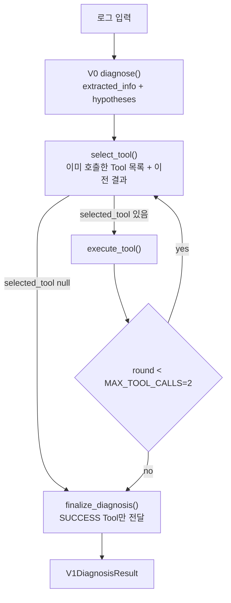
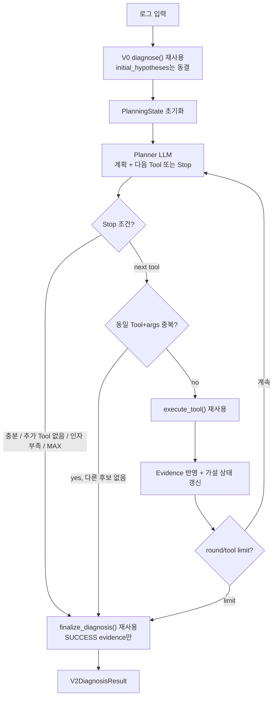
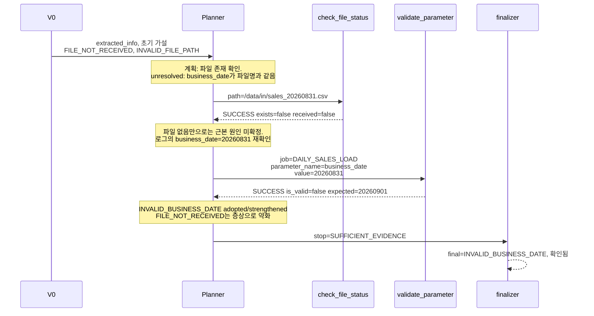

# V2 Dynamic Planning / Re-planning 설계

상태: 설계만. 이 문서 작성 시점에 V2 코드, prompt, schema, evaluator는 수정하지 않는다.

기준 브랜치: `main` (PR #7 30건 baseline + PR #8 설계 문서가 merge된 상태)  
handoff: `docs/next_steps_v2.md`  
공식 V1 baseline 리포트: `evaluation/reports/v0_vs_v1.md`

V2 구현·평가는 최신 `main`에서 시작한다. PR #7 브랜치(`cursor/eval-30-case-gt-32d6`)에서 이어가지 않는다.

## 0. 한 줄 목표

V1의 “매 라운드 Tool 하나 고르기(최대 2회)”를, 같은 Tool 계층 위에서 **계획 → 실행 → evidence 반영 → 충분성 판단 → 필요 시 Re-plan** 루프로 확장한다. 대표 검증 케이스는 **F-05**다. **F-04는 V3**로 남긴다.

## 1. V1과 V2의 차이

### 1.1 고정된 V1 baseline (30건, gpt-4.1)

출처: PR #7 `evaluation/reports/v0_summary.json`, `v1_summary.json`, `v0_vs_v1.md`.

| Metric | V0 | V1 |
| --- | --- | --- |
| Final Diagnosis Accuracy | 73.3% (22/30) | 93.3% (28/30) |
| Hypothesis Recall | 86.7% | 86.7% |
| Diagnosis Level Accuracy | 93.3% | 100.0% |
| Owner Accuracy | 100.0% | 100.0% |
| Required Tool Recall | N/A | 95.0% |
| Unnecessary Tool Rate | N/A | 6.7% |
| 평균 실행시간 | 6.17초/건 | 14.57초/건 |
| failed_runs | 0 | 0 |

이 숫자는 V1 baseline이다. Agent/Prompt를 F-05 등 개별 케이스에 맞춰 튜닝하지 않는다. V0 시스템 프롬프트를 F-05 가설 누락을 고치려고 바꾸지 않는다.

V1 실패 2건:

| case | GT | V1 예측 | Tool | 분류 |
| --- | --- | --- | --- | --- |
| F-05 | `INVALID_BUSINESS_DATE` | `FILE_NOT_RECEIVED` | `check_file_status`만, recall 0.5 | **V2** Planning / Re-planning |
| F-04 | `INVALID_FILE_PATH` | `FILE_NOT_RECEIVED` | `check_file_status`, recall 1.0 | **V3** Evidence 해석 / Critic |

### 1.2 V1 현재 실행 흐름

코드 근거: `app/baseline.py` `diagnose()`, `app/tool_use.py` `diagnose_v1()`.



실제 제약 (`app/tool_use.py`):

- `MAX_TOOL_CALLS = 2`
- 한 라운드에 Tool 1개
- `already_called`는 **Tool 이름** 기준. 같은 Tool을 다른 인자로 다시 부르지 못함
- SUCCESS evidence가 있으면 selector가 `null`로 종료할 수 있음
- FAILED Tool은 `app/tools/evidence.py` `supporting_tool_results()`에서 최종 근거에서 제외
- 최종 원인은 초기 가설에 없어도 SUCCESS Tool이 있으면 선택 가능 (`prompts/v1_final_diagnosis_prompt.txt` 원칙 1)
- 조사 계획 객체, 가설 상태 갱신, 충분성 판정 필드, stop_reason은 없음

F-05에서 V1이 멈춘 이유(평가 기록):

- 초기 `hypotheses`에 `INVALID_BUSINESS_DATE`가 없음 (`hypothesis_recall_hit=false`)
- `check_file_status` SUCCESS (`exists=false`, `received=false`) 후 추가 조사를 하지 않음
- 최종 원인을 표면 증상 `FILE_NOT_RECEIVED`로 확정

### 1.3 V2 목표 실행 흐름



핵심 추가:

- 명시적 조사 계획 (`investigation_plan`)
- 라운드별 충분성 판단
- 초기 가설에 없는 조사 후보를 **로그 / extracted_info / SUCCESS Tool data**에서 다시 생성
- Tool 결과로 가설 강화/약화/제거/신규 채택
- 종료 이유 (`stop_reason`)와 planning trace

그대로 두는 것:

- Canonical Cause Code 12개 (`app/cause_codes.py`)
- 4개 mock Tool과 `execute_tool()`
- FAILED ≠ 원인 근거 정책
- V0 `diagnose()` (초기 추출/가설)
- V1 최종 진단기의 역할 (표면 증상 vs 근본 원인 구분). V2는 이 해석기를 Critic으로 키우지 않음
- Ground Truth 30건과 채점 공식

### 1.4 재사용 vs 신규

| 구분 | 재사용 | 신규 (V2 전용) | 건드리지 않음 |
| --- | --- | --- | --- |
| 실행 | `diagnose()`, `execute_tool()`, `supporting_tool_results()`, `filter_evidence()`, `chat_complete()`, `_parse_json_with_retry` 패턴 | `diagnose_v2()`, Planner 루프 | `diagnose_v1()` 본체 |
| Schema | `Hypothesis`, `ToolResult`, `ToolSelection`, 최종 진단 필드 | `PlanningState` 관련 모델, `V2DiagnosisResult` | V0 `DiagnosisResult` 계약 (`final_cause` ∈ hypotheses) |
| Prompt | V0 system prompt, V1 final prompt를 기본으로 재사용 | `v2_planning_prompt.txt` | V0/V1 prompt 튜닝 |
| 평가 | `evaluate_payload()` — `initial_hypotheses` + `selected_tools`가 있으면 기존 V1 경로 | `v1_vs_v2.md` 리포트, `--version v2` | GT JSON, recall 공식 |
| UI | 입력 검증, 추출 정보, 최종 진단 렌더 | Plan / Re-plan / Evidence Update 섹션 | V0/V1 화면 동작 |

V1을 내부에서 planning 루프로 리팩터하지 않는다. `main.py --version v2`로 별도 진입한다.

## 2. V2 상태(State) 정의

사용자 예시 필드를 현재 코드에 억지로 1:1 매핑하지 않는다. 런타임 상태와 결과 JSON을 나눈다.

### 2.1 재사용 가능한 현재 필드

| 예시 필드 | 현재 위치 | V2 결정 |
| --- | --- | --- |
| input log | 함수 인자 `log_text`. 결과 스키마에 없음 | 런타임만 유지. 결과 JSON에 전체 로그를 넣지 않음 (기존 V0/V1과 동일) |
| extracted_info | `DiagnosisResult.extracted_info`, `V1DiagnosisResult.extracted_info` | 그대로 재사용. V0 출력을 복사 |
| hypotheses | V0 `hypotheses` → V1 `initial_hypotheses` | **초기 가설은 동결**. 평가의 Hypothesis Recall이 이 필드를 본다 (`evaluation/evaluator.py`) |
| executed_tools | V1 `selected_tools` | `selected_tools: list[ToolSelection]` 유지. 중복 방지용 fingerprint는 런타임 집합 |
| tool_results | `list[ToolResult]` | 그대로. SUCCESS/FAILED 계약 유지 |
| evidence | 최종 `list[str]` | 최종 진단 필드 유지. 라운드별 working evidence는 SUCCESS `ToolResult.data`에서 파생 |
| final diagnosis | `final_cause_code/name`, `diagnosis_level`, `owner`, `limitations`, `recommended_actions` | `V1DiagnosisResult`와 동일 필드명 유지 |

만들지 않는 것:

- 새 Cause Code
- `ToolResult.status` 확장 (SUCCESS/FAILED 유지)
- 로그 전문을 결과 스키마에 넣는 필드
- `executed_tools`라는 별도 리스트 (selected_tools와 중복)

### 2.2 신규 필드

구현 시 `app/schemas.py`에 V2 전용 모델을 추가한다. 지금 코드는 수정하지 않는다.

```text
InvestigationStep
  goal: str                          # 이 점검이 답하려는 질문
  candidate_tool: str | null
  arguments: dict                    # 로그/extracted_info/SUCCESS data에서만
  argument_status: READY | MISSING_ARGUMENTS
  related_cause_codes: list[str]     # Canonical 목록 안에서만. 초기 가설 밖 허용
  status: pending | executed | skipped_missing_args | blocked_duplicate

HypothesisState
  cause_code: str
  cause_name: str
  origin: initial | planner          # 초기 가설 vs 재조사로 채택
  status: active | strengthened | weakened | eliminated | adopted
  signals: list[str]                 # 로그 문구 또는 SUCCESS Tool key=value. CoT 금지

PlanningRound
  round_index: int                   # 1부터
  investigation_plan: list[InvestigationStep]
  hypothesis_states: list[HypothesisState]
  unresolved_questions: list[str]
  evidence_sufficient: bool
  selected_tool: str | null
  arguments: dict
  reason: str                        # 선택/종료의 관찰 가능한 이유. 내부 사고 과정 아님
  stop_reason: StopReason | null
  tool_result: ToolResult | null     # 이 라운드에서 실행한 경우만

StopReason
  SUFFICIENT_EVIDENCE
  NO_ADDITIONAL_TOOL
  MISSING_ARGUMENTS
  MAX_PLANNING_ROUNDS
  MAX_TOOL_CALLS
  DUPLICATE_TOOL_BLOCKED

V2DiagnosisResult  (V1DiagnosisResult 필드 +)
  version: "v2"
  initial_hypotheses: list[Hypothesis]     # V0 원본, 불변
  working_hypotheses: list[HypothesisState]
  investigation_plan: list[InvestigationStep]  # 마지막 계획 스냅샷
  unresolved_questions: list[str]
  current_round: int
  stop_reason: StopReason
  planning_trace: list[PlanningRound]
  selected_tools / tool_results / 최종 진단 필드: V1과 동일 이름
```

`HypothesisState.status`의 `adopted`는 초기 가설에 없다가 Planner가 조사 후보로 올린 코드다. F-05의 `INVALID_BUSINESS_DATE`가 여기 해당할 수 있다.

### 2.3 평가 호환

`evaluate_payload()`는 `initial_hypotheses` 또는 `selected_tools`가 있으면 V1 경로로 본다. V2 결과도 이 두 필드를 유지하면 **evaluator 수정 없이** 채점할 수 있다.

- Hypothesis Recall: 동결된 `initial_hypotheses` 기준. F-05는 V2가 최종 원인을 맞춰도 이 지표는 false로 남을 수 있다. 이는 V0 가설 품질 문제이며, 이번 설계에서 V0 prompt를 고치지 않으므로 **V2 성공 조건에서 제외**한다.
- Required Tool Recall / Unnecessary Tool Rate: `selected_tools`의 `selected_tool` 이름. 공식 변경 없음.
- Diagnosis Level: GT의 `expected_diagnosis_level_v1`을 그대로 사용. F-05는 `확인됨`. 새 GT 키를 만들지 않는다.

## 3. Planning

### 3.1 역할

라운드마다 Planner LLM이 JSON 하나만 출력한다. 계획 생성과 다음 Tool 선택을 **한 호출로 합친다**. V1 대비 LLM 호출이 늘어 latency가 커지므로, Plan LLM과 Select LLM을 분리하지 않는다.

출력 개요:

- 현재 `investigation_plan` (pending/executed 갱신)
- `hypothesis_states` 갱신안
- `unresolved_questions`
- `evidence_sufficient`
- 다음 `selected_tool` + `arguments` 또는 Stop

최종 진단 JSON은 만들지 않는다. 확정은 기존 finalizer가 한다.

### 3.2 계획 생성 규칙

1. 초기 가설을 우선 점검 대상으로 삼는다.
2. 초기 가설에 없더라도, 로그와 `extracted_info`에 있는 신호는 조사 후보가 될 수 있다.
   - 예: `business_date`, `input_path`가 함께 있고 파일명이 날짜를 포함하면 `validate_parameter` 후보
   - 허용 cause_code는 Canonical 목록만
3. Tool 인자는 아래 출처에만 채운다.
   - 원본 로그
   - `extracted_info`
   - 이전 **SUCCESS** Tool `data` (예: 반환된 `path`, `job_name`)
4. 로그/추출/SUCCESS data에 없는 connection, account, schema, table, path, 파라미터 값을 만들지 않는다. mock 카탈로그 키를 광고 문구에서 보고 집어넣지 않는다.
5. 필수 인자가 부족하면 그 step은 `MISSING_ARGUMENTS`이고 해당 Tool을 고르지 않는다. D-05 (`check_db_status`에 account 없음), C-05 (경로/파라미터 거의 없음)와 같은 기존 계약을 유지한다.
6. 한 라운드 Tool 1개.

### 3.3 중복 호출

V1: Tool **이름** 재호출 금지.  
V2: **Tool 이름 + 정규화한 arguments** fingerprint 재호출 금지.

```text
fingerprint = tool_name + json.dumps(arguments, sort_keys=True, ensure_ascii=False, default=str)
```

같은 Tool을 다른 인자로 부르는 것은 허용한다. 같은 인자 반복은 런타임에서 차단하고, 다른 후보가 없으면 `DUPLICATE_TOOL_BLOCKED`로 종료한다.

### 3.4 로그에 이미 원인이 있는 경우

P-05, C-01은 GT가 `NOT_NEEDED`인데 V1이 Tool을 호출했다. V2 Planner는 “로그만으로 충분하면 Tool을 고르지 않음”을 일반 규칙으로 둔다. 케이스 ID 특수 분기는 만들지 않는다. 이 개선은 부수 효과로 볼 수 있으며 F-05만큼의 성공 조건은 아니다.

## 4. Evidence Update

기존 정책 유지 (`app/tools/evidence.py`, V1 final prompt).

- 최종 원인 근거: **SUCCESS Tool data + 로그에서 직접 확인 가능한 문구**만
- FAILED Tool: `planning_trace`와 `tool_results`에 남긴다. `error`는 조사 실패(인자 부족, 카탈로그 없음)이지 원인 확정이 아니다. `filter_evidence()`가 FAILED error 문자열이 최종 evidence에 들어가지 않게 하는 동작은 그대로 쓴다
- Tool은 cause_code를 반환하지 않는다. 상태 필드만 반환한다 (`exists`, `is_valid`, `account_locked` 등)

가설 상태 갱신은 Planner JSON의 `hypothesis_states`로만 한다. 별도 Critic LLM을 두지 않는다.

| 갱신 | 의미 | 예 |
| --- | --- | --- |
| strengthened | SUCCESS data가 해당 가설과 부합 | `is_valid=false`, `expected_value` 불일치 → `INVALID_BUSINESS_DATE` |
| weakened | 일부만 맞거나 대안이 열림 | 파일 없음만 확인, 미수신/경로/날짜가 아직 갈림 |
| eliminated | SUCCESS data가 직접 반증 | `account_locked=false` → `DB_ACCOUNT_LOCKED` 약화/제거 |
| adopted | 초기 가설에 없었으나 조사 후보로 올림 | F-05에서 `INVALID_BUSINESS_DATE` |
| active | 아직 판단 전 | 초기 가설 유지 |

`eliminated`여도 Canonical 목록에서 코드를 삭제하지 않는다. 최종 선택만 막을 신호다.

Working evidence 요약은 Streamlit/trace용으로 SUCCESS `data`의 기존 요약 키를 쓴다 (`app/ui_service.py` `summarize_tool_data()`). 새 키를 만들지 않는다.

## 5. Re-planning 조건

다음 라운드 Planner를 호출하는 조건 (하나라도 해당, Stop이 아닐 때):

1. `evidence_sufficient=false` — 현재 SUCCESS evidence만으로 근본 원인을 갈라내지 못함
2. 초기/작업 가설이 SUCCESS 결과로 약화·반증되었는데 대안이 남음
3. 아직 확인하지 않은 관련 가설 또는 Planner가 로그에서 올린 신규 후보가 있고, 호출 가능한 Tool이 있음
4. 실행하지 않은 plan step이 있고 인자가 `READY`

F-05에 해당하는 구체 조건:

- `check_file_status`가 `exists=false`, `received=false`만 주면 `FILE_NOT_RECEIVED` / `INVALID_FILE_PATH` / `INVALID_BUSINESS_DATE`가 갈리지 않음
- 로그에 `business_date=20260831`, `JOB=DAILY_SALES_LOAD`, 파일명 `sales_20260831.csv`가 있음
- `validate_parameter` fingerprint가 아직 없음
- 필수 인자 `job_name`, `parameter_name`, `parameter_value`를 로그에서 채울 수 있음

Re-plan이 **하지 않는 것**: SUCCESS `same_directory_files`의 유사 파일명을 보고 `INVALID_FILE_PATH`로 확정하는 해석. 그것은 F-04 / V3 영역이다. 해당 필드는 Tool data에 이미 있으므로 finalizer가 볼 수는 있다. V2는 그 해석을 위한 새 규칙·Critic을 추가하지 않는다.

## 6. Stop 조건

런타임이 Planner 출력보다 우선하는 가드:

| stop_reason | 조건 |
| --- | --- |
| `SUFFICIENT_EVIDENCE` | Planner가 `evidence_sufficient=true`이고 다음 Tool이 없음. 또는 근본 원인을 가르는 SUCCESS evidence가 있고 남은 READY step이 없음 |
| `NO_ADDITIONAL_TOOL` | 남은 후보 Tool이 없거나, 있어도 인자 출처 규칙상 호출 불가 |
| `MISSING_ARGUMENTS` | 필요한 점검의 필수 인자가 로그/추출/SUCCESS data에 없음 |
| `MAX_PLANNING_ROUNDS` | Planner 호출 횟수 한도 도달 |
| `MAX_TOOL_CALLS` | 실제 Tool 실행 횟수 한도 도달 |
| `DUPLICATE_TOOL_BLOCKED` | Planner가 낸 Tool+args가 이미 실행됨, 대체 후보 없음 |

권장 한도 (구현 시 상수, 케이스별 분기 없음):

- `MAX_PLANNING_ROUNDS = 3` — 초기 계획 + Re-plan 여유 1~2
- `MAX_TOOL_CALLS = 3` — V1은 2. F-05는 Tool 2개면 충분. 3은 여유이지 모든 Tool을 도라는 뜻이 아님

한도는 무한 루프 방지용이다. F-05를 맞추려고 올리지 않는다.

종료 시 `stop_reason`을 결과 JSON과 trace에 반드시 기록한다.

## 7. F-05에서 기대하는 V2 흐름

### 7.1 사실 (현재 30건 세트)

로그 `data/sample_logs/F-05.log` (PR #7):

```text
JOB=DAILY_SALES_LOAD
business_date=20260831
input=/data/in/sales_20260831.csv
FileNotFoundError: /data/in/sales_20260831.csv
```

GT:

- `actual_cause_code`: `INVALID_BUSINESS_DATE`
- `required_tools`: `check_file_status`, `validate_parameter`
- mock 파일: 해당 path `exists=false`, `received=false`
- mock 파라미터: `DAILY_SALES_LOAD.business_date` expected `20260901`

V1 기록:

- 초기 가설: `FILE_NOT_RECEIVED`, `INVALID_FILE_PATH` (`INVALID_BUSINESS_DATE` 없음)
- Tool: `check_file_status`만
- 최종: `FILE_NOT_RECEIVED`

V2는 V0 가설 누락을 prompt 튜닝으로 고치지 않는다. Re-plan이 로그를 다시 보고 `validate_parameter`를 고를 수 있어야 한다.

### 7.2 기대 시퀀스



라운드 단위:

1. **로그 분석 (V0)**  
   FileNotFound 중심 가설. `INVALID_BUSINESS_DATE`가 없어도 진행.

2. **Plan #1**  
   `check_file_status` READY. `validate_parameter`는 후보로 계획에 올려도 되고, 첫 실행은 파일 확인이어도 된다. `unresolved_questions`에 실행일자/파일명 불일치를 남길 수 있다.

3. **Tool Call / Result**  
   `check_file_status`. SUCCESS, 미존재.

4. **Evidence Update**  
   `FILE_NOT_RECEIVED` strengthened 또는 유지. 근본 원인 확정은 아님 (`evidence_sufficient=false`).

5. **Re-plan**  
   초기 가설에 없어도 로그의 `business_date` + `job_name`으로 `validate_parameter` 인자를 채움. fingerprint 미실행.

6. **추가 Tool Call**  
   `validate_parameter`. SUCCESS, `is_valid=false`, `expected_value=20260901`.

7. **Evidence Update**  
   `INVALID_BUSINESS_DATE` adopted + strengthened. 파일 미존재는 잘못된 일자로 만든 경로의 증상으로 약화.

8. **Stop + Final**  
   `SUFFICIENT_EVIDENCE`. 최종 원인 `INVALID_BUSINESS_DATE`, `diagnosis_level=확인됨`. FAILED Tool 없음.

이 시퀀스를 케이스 하드코딩으로 구현하지 않는다. Planner 규칙이 F-05에 적용되는 것이 목표다.

### 7.3 성공/비성공

V2가 F-05에서 성공으로 보는 것:

- `selected_tools`에 `check_file_status`와 `validate_parameter` 모두 포함
- `final_cause_code=INVALID_BUSINESS_DATE`
- `diagnosis_level=확인됨`
- `stop_reason` 기록
- trace에 Plan → Tool → Update → Re-plan → Tool → Final이 보임

성공으로 보지 않는 것:

- `initial_hypotheses`에 `INVALID_BUSINESS_DATE`가 생기는 것 (V0 품질, 이번 범위 밖)
- Hypothesis Recall 상승 (같은 이유로 기대를 걸지 않음)

## 8. V2에서 해결하지 않을 것

- **F-04**: Tool은 `check_file_status`로 맞고 (`required_tool_recall=1.0`), mock은 로그 경로 없음 + 같은 디렉터리에 유사 파일 존재. V1 finalizer가 이를 `FILE_NOT_RECEIVED`로 읽는다. 해석/자기검증은 **V3 Critic / Reflection**
- 자기 검증 Agent, 별도 Critic LLM, 최종 진단 재검토 루프
- LangGraph, Multi-Agent, RAG, native OpenAI tool calling
- V0/V1 prompt 케이스 튜닝, GT 수정, 채점 공식 변경
- 실제 파일시스템/DB 접속
- 이미 `main`에 고정된 30건 GT와 `v0_vs_v1.md`를 재실행으로 덮어쓰기

V2 공식 평가에서 F-04가 그대로 틀려도 V2 실패로 보지 않는다. 우연히 맞아도 이번 목표 달성은 아니다.

## 9. 무한 루프 방지

계층:

1. `MAX_PLANNING_ROUNDS = 3`
2. `MAX_TOOL_CALLS = 3`
3. 동일 Tool + 동일 arguments fingerprint 재실행 금지 (런타임 가드, LLM이 다시 내도 실행하지 않음)
4. `selected_tool=null` 또는 `evidence_sufficient=true`면 즉시 finalizer
5. 모든 종료에 `stop_reason` 필수

Planner가 매 라운드 계획을 새로 써도, 실행 여부는 fingerprint와 한도가 결정한다.

## 10. 관찰 가능한 Trace

LLM 내부 Chain-of-Thought를 생성·노출하지 않는다. 저장·표시하는 것은 JSON 필드와 Tool I/O뿐이다.

`main`의 `app/trace.py`는 V0/V1 결과를 **사후 재구성**한다. V2는 실행 중 `planning_trace`를 남긴다. V2 결과만으로 UI를 그릴 수 있어야 한다. 기존 `trace.py`에 매핑 어댑터를 추가할 수 있으나, V2 payload가 그 모듈에 종속되면 안 된다.

Streamlit에 보여야 하는 순서:

1. Plan — `investigation_plan`, unresolved questions
2. Tool Call — tool, arguments, reason
3. Tool Result — SUCCESS data 요약 또는 FAILED error (최종 근거 아님 표시)
4. Evidence Update — hypothesis_states 변경
5. Re-plan — 다음 계획 / 왜 추가 조사가 필요한지
6. 추가 Tool Call / Result / Update (반복)
7. Stop reason
8. Final Diagnosis — 기존 최종 진단 블록

CLI 결과 JSON에도 `planning_trace`가 들어간다. 데모 전용 별도 채널을 만들지 않는다.

진입점:

- `main.py --version v2`
- Streamlit 모드에 `V2 Dynamic Planning` 추가
- `app/ui_service.py` `run_backend()`에 `v2` 분기만 추가. V0/V1 분기는 유지

## 11. 평가 계획

### 11.1 재사용

- 공식 Ground Truth 30건 그대로 (`evaluation/ground_truth.json`, PR #7)
- 로그 `data/sample_logs/{F,P,D,S,C}-NN.log`
- 채점: Final Diagnosis Accuracy, Required Tool Recall, Unnecessary Tool Rate, Diagnosis Level Accuracy, Owner Accuracy, Hypothesis Recall (참고 지표)
- latency: `average_elapsed_seconds`. 로컬 PoC 측정. 운영 절감 수치로 쓰지 않음

### 11.2 비교 방법

- V0/V1 30건 리포트(`v0_vs_v1.md`)는 **덮어쓰지 않음**. baseline 고정
- 새 실행: `python evaluation/run_evaluation.py --versions v1 v2` 형태의 확장 (구현 단계)
- 새 산출: `evaluation/reports/v2_summary.json`, `evaluation/reports/v1_vs_v2.md`
- V1을 재실행해 baseline과 어긋나면, 새 V1 숫자로 V2를 유리하게 바꾸지 않고 **문서화된 30건 V1을 기준**으로 둔다. 재실행은 참고다

### 11.3 V2 판정

| 항목 | 기대 |
| --- | --- |
| F-05 final cause | `INVALID_BUSINESS_DATE` |
| F-05 required tools | `check_file_status` + `validate_parameter` |
| F-04 | 개선을 요구하지 않음 |
| 30건 Final Diagnosis Accuracy | V1 93.3% (28/30) 대비 하락하지 않는 것을 1차 가드. F-05만 교정되면 29/30이 가능하나, 다른 케이스 회귀가 있으면 실패 |
| Required Tool Recall | F-05 0.5 → 1.0이 목표. 전체 평균은 V1 95.0%에서 소폭 상승 가능 |
| Unnecessary Tool Rate | V1 6.7%를 크게 올리면서 F-05를 맞추면 안 됨. 모든 Tool 나열 금지 |
| Diagnosis Level Accuracy | F-05는 `확인됨` 유지. 전체에서 V1 100% 대비 큰 하락이 있으면 조사 |
| Hypothesis Recall | 변동 없거나 무시. F-05 초기 가설 누락은 V2가 고치지 않음 |
| latency | V1보다 길 수 있음. Planner 라운드 증가 때문. 한도 안에서만 허용 |
| failed_runs | 0 유지 |

## 12. 예상 수정/신규 파일

지금은 목록만. 이 문서 외에 파일을 바꾸지 않는다.

### 신규

| 파일 | 역할 |
| --- | --- |
| `docs/v2_dynamic_planning_design.md` | 이 문서 |
| `app/planning.py` | `diagnose_v2()`, Planner 루프, fingerprint, stop 가드 |
| `prompts/v2_planning_prompt.txt` | Planner JSON 계약 |
| `results/v2_planning/.gitkeep` | V2 결과 저장 |
| `tests/test_v2.py` | 루프/stop/fingerprint/F-05 시퀀스 (LLM mock) |
| `tests/test_v2_schemas.py` | 상태 모델 검증 |

`prompts/v2_final_diagnosis_prompt.txt`는 기본 만들지 않는다. V1 final prompt를 재사용한다. 재사용으로 최종 JSON이 안 맞을 때만 최소 추가를 검토한다.

### 수정 (구현 단계)

| 파일 | 변경 |
| --- | --- |
| `app/schemas.py` | InvestigationStep, HypothesisState, PlanningRound, StopReason, V2DiagnosisResult |
| `config/settings.py` | V2 prompt 경로, `V2_RESULTS_DIR` |
| `main.py` | `--version v2` |
| `app/ui_service.py` | `run_backend` v2 |
| `streamlit_app.py` | V2 모드, planning_trace 렌더 |
| `evaluation/run_evaluation.py` | `choices`에 v2, 결과 디렉터리, `v1_vs_v2.md` |
| `evaluation/report.py` | V1 vs V2 비교 표. 기존 `v0_vs_v1.md` 생성 로직은 유지 |
| `README.md` | V2 실행/평가 안내 |

### 의도적으로 수정하지 않음 (구현 1차)

- `app/tool_use.py` — V1 유지
- `app/tools/*` — Tool 계약 유지
- `app/baseline.py`, `prompts/v0_system_prompt.txt`, `prompts/v1_*.txt`
- `evaluation/ground_truth.json`, `evaluation/metrics.py` 채점 공식
- `evaluation/evaluator.py` — V2가 `initial_hypotheses`/`selected_tools`를 유지하면 수정 불필요. payload 판별이 깨질 때만 최소 수정

`app/trace.py`는 이제 `main`에 있다. V2 `planning_trace`를 이 모듈에 매핑하거나 Streamlit이 직접 그려도 된다.

## 13. 구현 단계 제안

코드는 다음 세션. 5단계.

### 단계 1 — 골격과 가드

- `V2DiagnosisResult` 등 스키마
- `diagnose_v2()`가 V0 → (빈 plan) → 기존 `select_tool` 없이 루프 골격만 돌리거나, Planner 없이 stop 가드·fingerprint·한도만 있는 스텁
- `main.py --version v2`가 결과를 `results/v2_planning/`에 저장
- V1 경로 회귀 테스트 유지

이 단계 종료 조건: v2 엔트리가 V0 가설 + Tool 0회 + stop_reason으로도 스키마 유효. 아직 F-05를 풀지 않아도 됨.

### 단계 2 — Planner 루프

- `v2_planning_prompt.txt`
- 계획 / 충분성 / 로그 기반 신규 후보 / 가설 상태
- SUCCESS/FAILED evidence 반영
- `MAX_*`와 fingerprint 가드 연결
- 최종은 기존 `finalize_diagnosis()` 재사용

종료 조건: LLM을 mock한 테스트에서 F-05 시퀀스(파일 점검 → 불충분 → 파라미터 점검 → INVALID_BUSINESS_DATE)가 재현됨.

### 단계 3 — 관찰 가능성

- Streamlit V2 모드
- Plan / Tool Call / Result / Evidence Update / Re-plan / Final / stop_reason
- CLI JSON에 `planning_trace`

종료 조건: F-05 mock 결과를 UI에서 위 순서로 볼 수 있음. V0/V1 모드 회귀 없음.

### 단계 4 — 테스트

- fingerprint 중복 차단
- 인자 hallucination 시 실행하지 않음 (D-05 유형 fixture)
- FAILED가 최종 evidence에 안 들어감
- MAX round/tool stop_reason
- F-05 happy path (mock)
- F-04는 “V2가 해석을 강제하지 않음”만 고정. 정답 하드코딩 없음

종료 조건: 기존 pytest + 신규 V2 테스트 통과. 실제 LLM 호출 없는 단위 테스트가 기본.

### 단계 5 — 공식 30건 평가

- 베이스: `main`의 30건 GT와 고정 V1 리포트
- `run_evaluation.py --versions v1 v2` (또는 v2만 돌리고 문서화된 V1과 비교)
- `v1_vs_v2.md` 작성, `v0_vs_v1.md` 미변경
- F-05와 회귀 케이스 분석. Prompt를 케이스에 맞춰 재튜닝하지 않음

종료 조건: 11.3 판정표를 실제 숫자로 채움. 미달이면 설계 가드(한도, 인자 규칙) 안에서만 수정하고 GT/V0는 건드리지 않음.

## 14. 구현 시 하지 말 것

- V1 `tool_use.py`를 planning 루프로 치환
- F-05/F-04 케이스 ID 분기
- V0 가설에 `INVALID_BUSINESS_DATE`를 넣도록 prompt 수정
- F-04를 맞추기 위한 `same_directory_files` 해석 규칙
- Critic 에이전트
- 이 설계를 구현과 동시에 넣는 것 — 구현은 별도 변경

## 15. 열린 결정 (구현 착수 시 확인)

아래는 설계에서 기본값을 정했다. 뒤집을 이유가 없으면 유지한다.

1. Planner와 다음 Tool 선택은 한 LLM 호출 — latency 우선
2. Finalizer는 V1 함수 재사용
3. Hypothesis Recall은 V2 KPI가 아님
4. 구현 베이스는 최신 `main` (30건 GT와 공식 V0/V1 평가가 이미 포함됨)
5. `MAX_PLANNING_ROUNDS=3`, `MAX_TOOL_CALLS=3`
